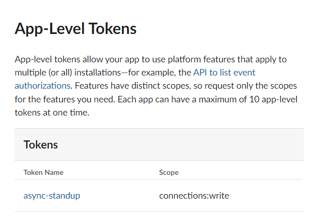
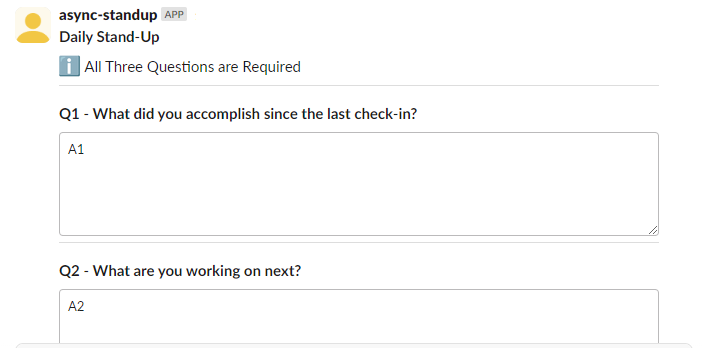

# Setting up the App in Slack

## Step 1 Create a New Bot App


Navigate to

[https://api.slack.com/apps](https://api.slack.com/apps)

And select Create New App


And Select From an App Manifest


1.  Select the workspace that you wish to install the app, from the list that you have permissions to

2.  Below is the Manifest that you will need, replace the YAML example code with the Manifest below

```YAML
display_information:
  name: Async StandUp
  description: Your friendly app to assist in Async StandUps
  background_color: "#c55100"
  long_description: This app is designed to be added to your channels to assist in helping you conduct Async Daily StandUp. By messaging the App in the channel with the phrase “StandUp”, the app will send a request for a StandUp update to the channel. Each response by members of the channel is maintained within the thread for easy review.
features:
  bot_user:
    display_name: async-standup
    always_online: false
oauth_config:
  scopes:
    bot:
      - channels:history
      - channels:read
      - chat:write
      - chat:write.public
      - groups:history
      - im:history
      - mpim:history
      - users:read
      - users.profile:read
      - app_mentions:read
settings:
  event_subscriptions:
    bot_events:
      - app_mention
      - message.channels
      - message.groups
      - message.im
      - message.mpim
  interactivity:
    is_enabled: true
  org_deploy_enabled: true
  socket_mode_enabled: true
  token_rotation_enabled: false


```


3.  Select Create

## Step 2 Install to Workspace


Navigate to Install Apps and select Install to Workspace


Select Allow, once it appears Green


## Step 3 Give the Bot permissions to read and write over WebSockets


## Step 4 Save the Bot User Token

Navigate to Install App and copy the Bot User OAuth Token


## Step 5 Save the App User Token

Navigate to Basic Information and scroll down to App Level Tokens



Click on Token and copy the token string


## Step 6 Run the App locally

With both tokens, you can now run the application locally

``` BASH
go run . -bottoken=[BOT USER TOKEN] –apptoken=[APP USER TOKEN]
```

## Step 7 Navigate to Slack Channel

Write in channel

```
@async-standup standup
```

Slackbot may ask you to invite @async-standup to channel, select Yes

@async-standup should then respond with the Async StandUp




## Step 8 Enjoy 

